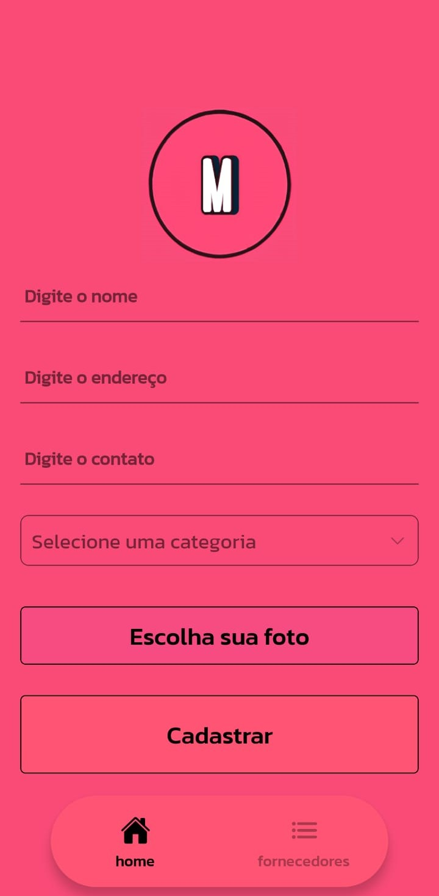

# Meeting App

A empresa "Meeting" busca criar um aplicativo móvel eficaz para o cadastro de
fornecedores, com listas e imagens de alta qualidade, economizando recursos e
proporcionando uma excelente experiência ao usuário. A escolha da tecnologia React
Native é crucial para estabelecer uma presença sólida no mercado móvel. App criado baseado no que foi pedido na missão prática do nível 1 (RPG0023 - Vamos criar um App) do Mundo 4 no curso de Desenvolvimento Full-Stack da Estácio.


## Stack utilizada

**Mobile:** React Native


## Rodando localmente

### Clone o projeto

```bash
  git clone https://github.com/Alvimm/m4n1
```


### Entre no diretório do projeto

```bash
  cd m4n1
```


### Instale as dependências

```bash
  npm install
```


### Inicie a aplicação

#### Para Android

```bash
npx react-native run-android
```

#### Para iOS

```bash
npx react-native run-ios
```


## Screenshots

<div style="display: flex; justify-content: center;">
  
  
  
</div> 


## Autor

- [@alvimm](https://www.github.com/Alvimm)